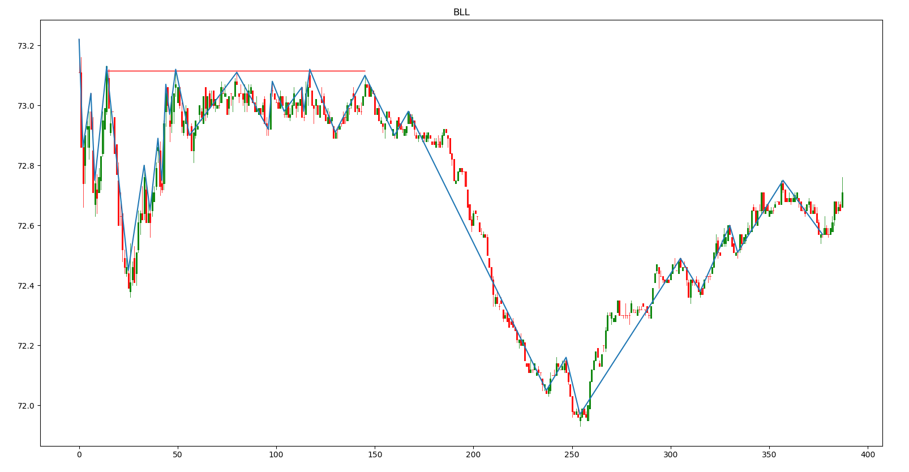
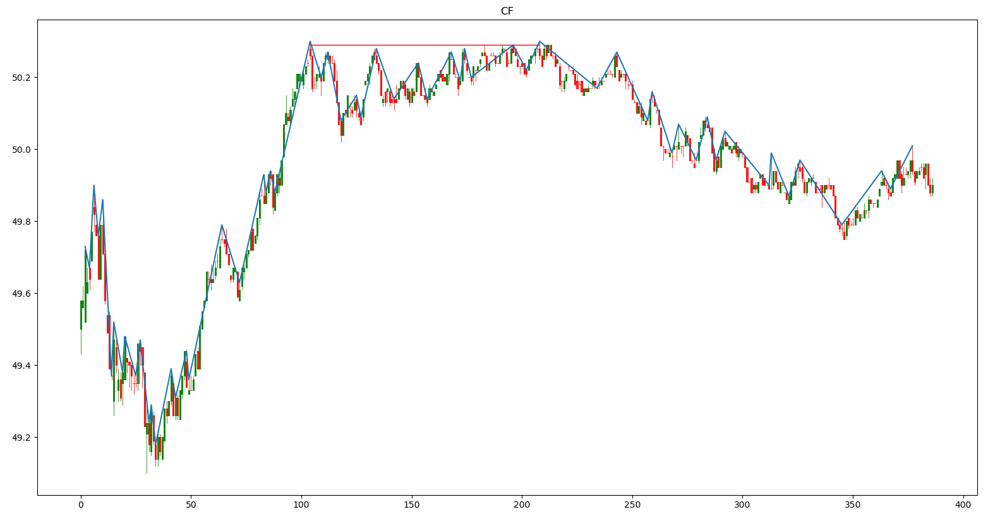
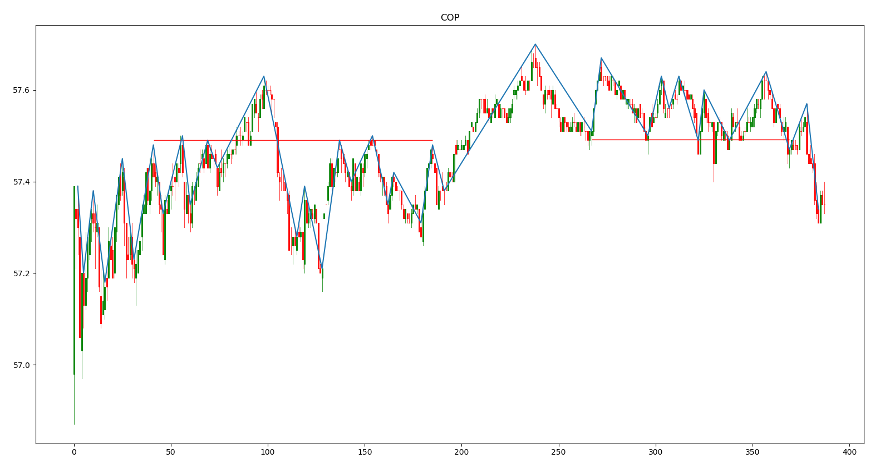
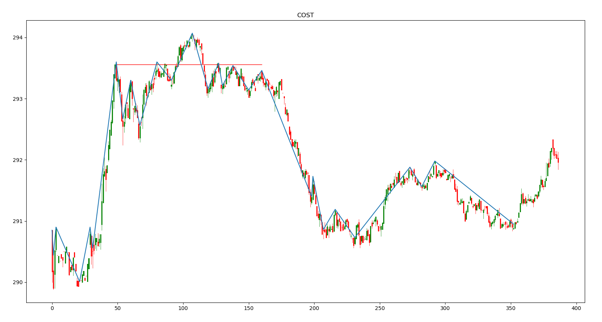
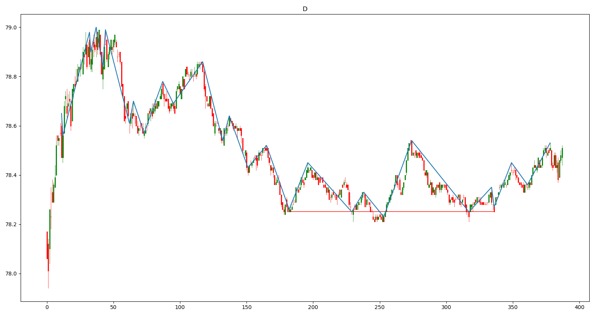
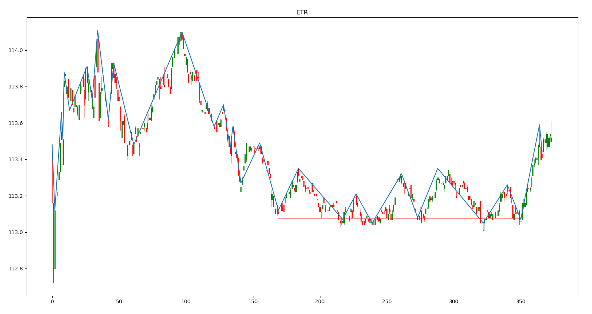
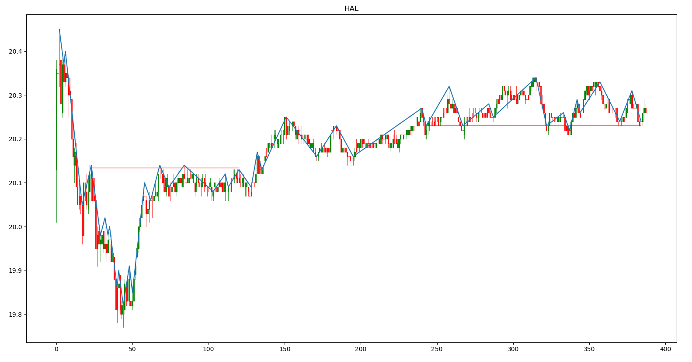
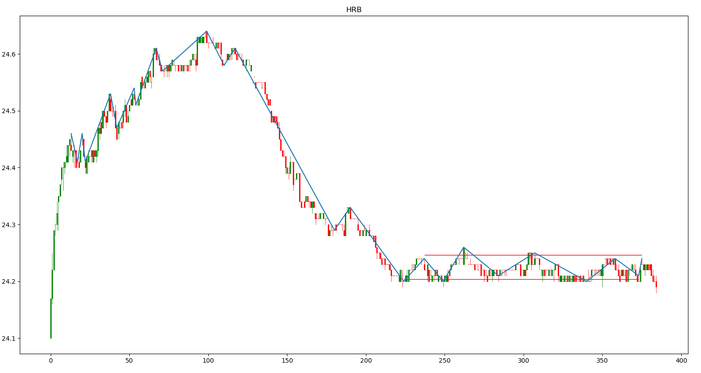

# Algorithmic-Support-and-Resistance


Uses the [zig-zag](https://www.investopedia.com/terms/z/zig_zag_indicator.asp "Investopedia Definition") technical indicator to mark reversal points. If there are multiple reversals at a close price range, it averages them out and draws a support/resistance line. Displays a candle-stick chart with the zig-zag indicator and the support/resistance lines marked. Currently loops through a list of s&p500 stocks, getting the data from yahoo finance.

```
usage: Support&Resistance.py [-h] [-t TICKERS] [-p PERIOD] [-i INTERVAL]
                             [-d DIF] [--time TIME] [-n NUMBER] [-m MIN]
                             [-o OUTDIR] [-hl | --hlines | --no-hlines]

Algorithmic Support and Resistance

optional arguments:
  -h, --help            show this help message and exit
  -t TICKERS, --tickers TICKERS
                        Used to look up a specific tickers. Commma seperated.
                        Example: MSFT,AAPL,AMZN default: List of S&P 500
                        companies
  -p PERIOD, --period PERIOD
                        Period to look back. valid periods:
                        1d,5d,1mo,3mo,6mo,1y,2y,5y,10y,ytd,max. default: 1d
  -i INTERVAL, --interval INTERVAL
                        Interval of each bar. valid intervals:
                        1m,2m,5m,15m,30m,60m,90m,1h,1d,5d,1wk,1mo,3mo.
                        default: 1m
  -d DIF, --dif DIF     Max % difference between two points to group them
                        together. Default: 0.05
  --time TIME           Max time measured in number of bars between two points
                        to be grouped together. Default: 150
  -n NUMBER, --number NUMBER
                        Min number of points in price range to draw a
                        support/resistance line. Default: 3
  -m MIN, --min MIN     Min number of bars from the start the
                        support/resistance line has to be at to display chart.
                        Default: 150
  -o OUTDIR, --outdir OUTDIR
                        Output the graph files to this directory
  -hl, --hlines, --no-hlines
                        Extend the support/resistance lines to the full width
                        of the graph
```

Example Charts:








