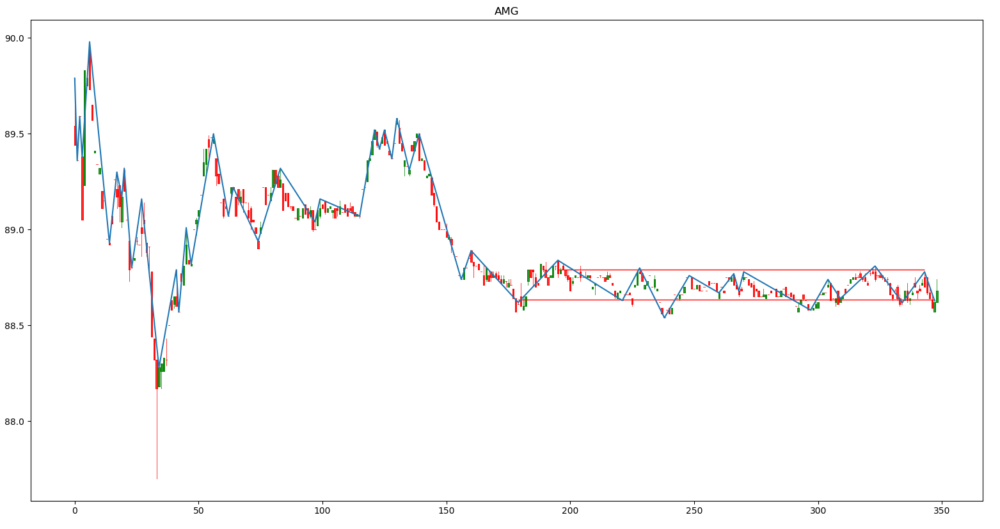

# Algorithmic-Support-and-Resistance

Uses the [zig-zag](https://www.google.com "Investopedia Definition") technical indicator to mark reversal points. If there are multiple reversals at a close price range, it averages them out and draws a support/resistance line. Displays a candle-stick chart with the zig-zag indicator and the support/resistance lines marked. Currently loops through a list of s&p500 stocks, getting the data from yahoo finance.

Example Charts:

